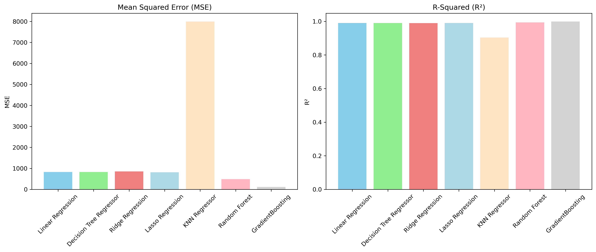
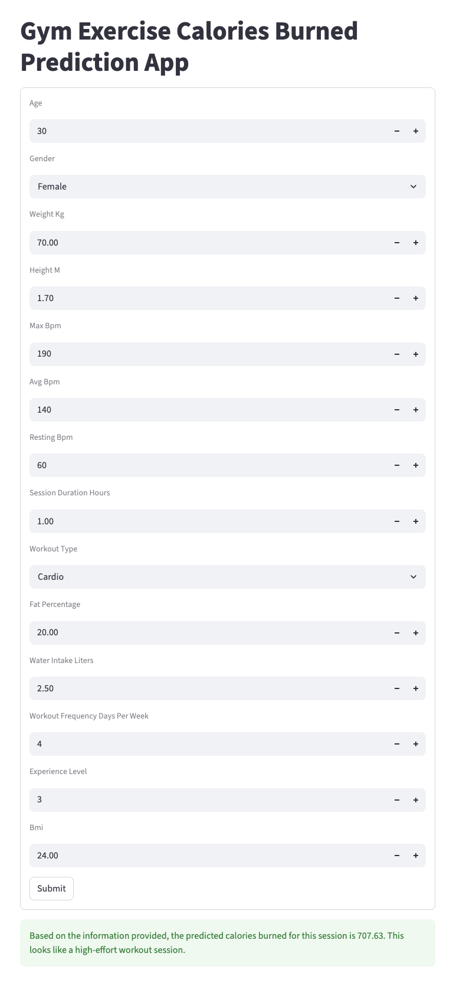

# Gym Members — Workout Insights & Predicting Calories Burned

**Author** Sumeet

---

## Overview

This project analyzes the Gym Members Exercise Dataset to build regression models that predict **`Calories_Burned`** from physiological, and workout-related features. 

The project covers:

- exploratory data analysis
- feature engineering
- preprocessing
- model training
- cross-validation
- model comparison
- lightweight local web deployment

The final goal is to understand **what drives calorie expenditure during workouts** and to build a reliable model that can estimate calories burned from easily available workout inputs.

---
## Executive Summary

This project investigates how member characteristics and workout behavior influence calorie expenditure during gym sessions.

Using features such as:

- age
- gender
- BMI
- workout type
- session duration
- average BPM
- workout frequency
- experience level

the project trains and evaluates multiple regression models to predict **`Calories_Burned`**.

Among all models tested, **Gradient Boosting Regressor** performed best overall and is the recommended model for prediction on this dataset.
 
 ---

 ## Business Value

Understanding calorie burn drivers can help:

- **gym members** set more realistic fitness goals
- **personal trainers** personalize workout plans
- **fitness apps** estimate workout output without expensive wearables
- **fitness businesses** improve engagement through smarter workout recommendations

This makes calorie prediction a useful tool for both personalization and retention.

---

## Research Questions

### Primary Question
Can we predict an individual’s calories burned during a gym session using workout features such as:

- session duration
- average BPM
- workout type
- BMI
- experience level

### Secondary Question
Which workout behaviors and member characteristics most strongly influence gym performance outcomes such as:

- calories burned
- workout consistency
- engagement-related patterns

and how can those insights be used to improve member experience and retention?

---

## Dataset

- **Local file:** `data/gym_members_exercise_tracking.csv`
- **Original source:** Kaggle dataset by Valakhorasani

Dataset link:  
`https://www.kaggle.com/datasets/valakhorasani/gym-members-exercise-dataset`

---


## Key Findings from EDA

Exploratory data analysis showed several clear patterns:

- **Session duration** and **average BPM** are the strongest predictors of calories burned
- **HIIT** and **cardio** workouts tend to produce higher calorie expenditure
- **Experience level** is associated with higher workout frequency and higher calories burned per session
- Members with more workout activity also tend to report **higher water intake**
- The dataset shows realistic physiological relationships, making it suitable for regression modeling
- **Male members** generally burn more calories than female members across workout types in this dataset

---

## Methodology

This project follows the **CRISP-DM** framework.

### 1. Business Understanding
Identify the main drivers of calorie expenditure during workouts.

### 2. Data Understanding
Perform exploratory data analysis to understand:

- feature distributions
- correlations
- workout patterns
- variable relationships

### 3. Data Preparation
Feature engineering included creation of:

- `Age_Group`
- `BPM_Duration_Index` = `Avg_BPM * Session_Duration`
- `Intensity` = `Avg_BPM / Session_Duration`

### 4. Preprocessing
The modeling pipeline includes:

- numeric imputation using median
- categorical imputation using most frequent value
- scaling with `StandardScaler`
- one-hot encoding for categorical features

### 5. Modeling
The following models were evaluated:

- `LinearRegression`
- `Ridge`
- `Lasso`
- `KNeighborsRegressor`
- `RandomForestRegressor`
- `GradientBoostingRegressor`
- `DecisionTreeRegressor`

### 6. Evaluation
Models were evaluated using:

- train/test split
- cross-validation
- **MSE** (Mean Squared Error)
- **R²** score

---

## Findings

### Main Outcome

The most important predictors of calorie burn were:

- **Session Duration**
- **Average BPM**
- **BPM_Duration_Index**

### Best Untuned Model

**GradientBoostingRegressor** was the strongest overall untuned model:

- **CV_MSE:** `115.969`
- **CV_R2:** `0.998610`

### Model Comparison

| Model | CV_MSE | CV_R2 |
|---|---:|---:|
| GradientBoosting | 115.969243 | 0.998610 |
| RandomForest | 458.086096 | 0.994509 |
| Lasso | 813.873983 | 0.990244 |
| DecisionTreeRegressor | 815.497436 | 0.990225 |
| LinearRegression | 829.202452 | 0.990061 |
| Ridge | 853.381660 | 0.989771 |
| KNN | 7993.131282 | 0.904188 |

### Model Performance Visualization



---

## Hyperparameter Tuning

Hyperparameter tuning was applied to the top three best models.

| Tuned Model | Tuned_CV_MSE | Tuned_CV_R2 | Best Parameters |
|---|---:|---:|---|
| GradientBoosting | 179.832458 | 0.997436 | `learning_rate=0.1`, `max_depth=3`, `min_samples_split=2`, `n_estimators=200` |
| Lasso | 858.013974 | 0.987962 | `alpha=0.1`, `max_iter=1000`, `tol=0.0001`|
| RandomForest | 2321.108106 | 0.967313 | `max_depth=20`, `max_features='sqrt'`, `min_samples_leaf=1`, `min_samples_split=2`, `n_estimators=200` |

## Interpretation

- **Gradient Boosting** remained the most reliable model after tuning
- Tuning did **not** improve on the earlier untuned notebook results for random forest or decision tree
- This suggests the original gradient boosting setup was already close to optimal for this dataset

---

## Final Recommendation

The recommended model for this project is:

### `GradientBoostingRegressor`

Why:

- best overall predictive performance
- strong generalization on validation
- captures nonlinear workout relationships effectively
- performs better than linear baselines and KNN

From a business perspective, **workout intensity and duration matter the most**, which makes these variables especially useful for personalized workout recommendations.

---

## Lightweight Web Deployment

This project includes a lightweight local deployment inside the [`web`](web) folder.

### Components

- [`main.py`](./web/main.py)  
  FastAPI backend with:
  - `GET /`
  - `POST /predict`

- [`ui_app.py`](./web/ui_app.py)  
  Streamlit frontend for entering workout inputs and viewing predicted calories burned

- [`test.ipynb`](./web/test.ipynb)  
  act as an unit test
  
The backend reconstructs engineered features such as:

- `Age_Group`
- `BPM_Duration_Index`
- `Intensity`

before generating predictions.

### App Screenshot



---

## Installation

#### Install the required packages:

```bash
python -m pip install fastapi uvicorn joblib pandas scikit-learn
python -m pip install --upgrade streamlit
```

#### To run the local app:

**1**. Start the FastAPI backend:
```bash
cd web
uvicorn main:app --reload
```

**2**. Start the Streamlit frontend in a second terminal:
```bash
cd web
streamlit run ui_app.py
```

**3**. Open the UI in your browser:
```text
http://127.0.0.1:8501
```

##  Deployment Notes:

- The current saved model file in `web/` is `GradientBoosting_spf_20260325_064019UTC.pkl`.
- The local environment should use `scikit-learn==1.6.1` so the serialized pipeline can be loaded without version-compatibility errors.

## Future Improvements

### Potential next steps for improving the project:

- use more robust k-fold cross-validation and report confidence intervals
- try stronger boosting methods such as:
    - HistGradientBoostingRegressor
    - XGBoost
    - LightGBM
- experiment with model ensembling
- validate performance on an external dataset
- add nutrition and intake-related features to compare calories consumed vs calories burned
- extend the project toward workout consistency and member retention prediction
---
## Project Structure
```text
├── data/
│   └── gym_members_exercise_tracking.csv
├── images/
│   ├── calories_burned_by_workout_type_gender_age_experience.png
│   ├── correlation_heatmap.png
│   ├── exercise_dashboard.png
│   ├── feature_correlation.png
│   └── Gym_excercise_calorie_burn_app.png
│   ├── model_performance.png
│   ├── pairplot.png
│   ├── predicted_vs_actual.png
│   ├── water_intake_vs_calories.png
│   ├── workout_frequency_by_experience_level.png.png
├── web/
│   ├── main.py
│   ├── ui_app.py
│   ├── test.ipynb
│   └── GradientBoosting_spf_20260325_064019UTC.pkl
└── gym_member_exercise.ipynb
```

## Notebook
- [Notebook — Gym Members Exercise Analysis](gym_member_exercise.ipynb)

---
## Contact 

#### For questions, feedback, or collaboration:
- open an issue in this repository
- or contact the author, Sumeet, through the GitHub profile associated with this project

#### For full code, visualizations, and detailed experimentation, see:
- gym_member_exercise.ipynb
